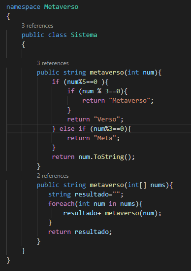

# Examen 

**Oscar Álvarez**

En este examen hemos tenido que realizar un programa y sus tests, el programa funciona pasandole un numero (en este caso se los paso yo) y si es multiplo de 3 o de 5 hará una cosa u otra dependiendo del resultado, si es multiplo de ambos entonces dará uno distinto tambien

En el programa he creado un metodo sobrecargado que en funcion del argumento utilice uno u otro.

Este es el codigo del programa:

Y estos son los tests que he realizado para comprobar si funcionaba correctamente:

