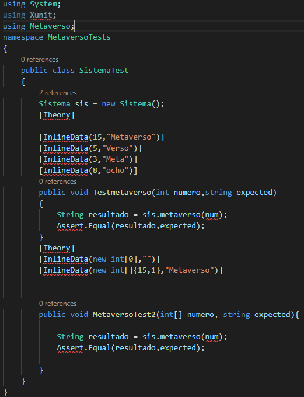

# Examen 

**Oscar Álvarez**
En este examen hemos tenido que realizar un programa y sus tests.

En el programa he creado un metodo sobrecargado que en funcion del argumento utilice uno u otro.

Este es el codigo del programa:

Y estos son los tests que he realizado para comprobar si funcionaba correctamente:

